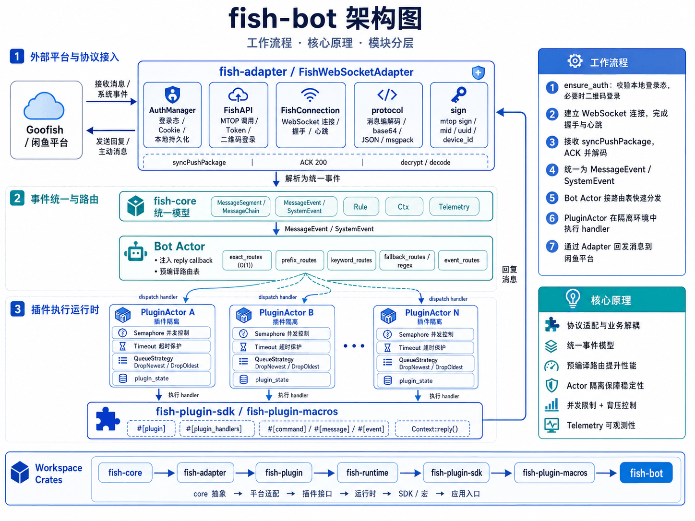

# fish-bot



`fish-bot` 是一个围绕 fish 消息场景构建的 Rust 插件运行时。

仓库拆成四层：

- `fish-core`
  定义稳定抽象：`BaseAdapter`、`AdapterEventSink`、消息模型、事件模型、规则、共享上下文。
- `fish-runtime`
  负责运行时编排：加载插件、分发消息、管理上下文和 telemetry。
- `fish-rt-adapter`
  提供默认的 fish 适配器 `FishWebSocketAdapter`，包含 Cookie 导入、MTOP token 获取、WebSocket 建连和协议处理。
- `fish-plugin-macros`
  提供 `#[plugin]`、`#[message]`、`#[event]` 这套插件声明宏。

如果你只想用现成的 fish 运行时，直接用 `fish-rt-adapter`。
如果你想把运行时接到别的平台，实现 `BaseAdapter` 就够了。

## 现在仓库里有什么

```text
crates/
  fish-core
  fish-runtime
  fish-rt-adapter
  fish-plugin-macros

examples/
  quickstart-simple   宏插件示例
  quickstart-custom   actor-first 插件示例

tests/
  adapter_test.rs
  protocol_test.rs
  model_test.rs
  fish_rt_adapter_api_test.rs
```

依赖方向保持单向：

```text
fish-runtime -> fish-core
fish-rt-adapter -> fish-core + fish-runtime
fish-plugin-macros -> fish-runtime
```

## 核心模型

运行时的职责很简单：把外部平台消息交给插件。

```text
BaseAdapter
  -> RuntimeHost
     -> Plugin
        -> handler
```

边界也很明确：

- `BaseAdapter`
  负责接入外部平台，以及发送消息。
- `RuntimeHost`
  负责把 adapter、plugins、`Ctx`、`Telemetry` 组装起来并启动。
- `Plugin`
  负责业务处理。

这意味着宿主不需要知道 fish 协议细节，也不需要知道运行时内部的调度实现。

## 快速开始

先确认本机有 Rust 工具链：

```bash
cargo --version
```

然后直接跑 example。

宏插件版本：

```bash
cargo run -p fish-example-quickstart-simple
```

actor-first 版本：

```bash
cargo run -p fish-example-quickstart-custom
```

如果你已经从浏览器拿到了完整 Cookie 请求头，可以在启动前导入：

```bash
cargo run -p fish-example-quickstart-simple -- --cookies "cookie2=...; unb=...; _m_h5_tk=..."
```

或者：

```bash
cargo run -p fish-example-quickstart-custom -- --cookies "cookie2=...; unb=...; _m_h5_tk=..."
```

导入后会把可用 Cookie 持久化到 `data/fish_auth.json`。

## Cookie 和认证文件

仓库支持直接导入浏览器抓到的原始 `Cookie` header：

```rust
use fish_rt_adapter::import_browser_cookies;

let report = import_browser_cookies(raw_cookie_header).await?;
println!("imported {} cookies into {}", report.imported, report.path.display());
```

解析时会自动忽略浏览器附带的 Cookie 属性，例如：

- `Max-Age`
- `Expires`
- `Path`
- `Domain`
- `SameSite`
- `Secure`
- `HttpOnly`

默认的认证文件路径是 `data/fish_auth.json`。这个文件已经在 `.gitignore` 中忽略，不应该提交。

## 最小宿主示例

标准启动方式就是把 adapter 和 plugins 交给 `RuntimeHost`：

```rust
use std::sync::Arc;

use fish_rt_adapter::plugin;
use fish_rt_adapter::prelude::*;
use fish_rt_adapter::{BaseAdapter, FishWebSocketAdapter, RuntimeHost, Telemetry};

struct EchoPlugin;

#[plugin]
impl EchoPlugin {
    #[message("/ping")]
    async fn ping(&self, ctx: MessageContext) -> Result<()> {
        ctx.reply("pong").await?;
        Ok(())
    }
}

#[tokio::main]
async fn main() -> Result<()> {
    let adapter: Arc<dyn BaseAdapter> = Arc::new(FishWebSocketAdapter::new());
    let plugins: Vec<Arc<dyn Plugin>> = vec![Arc::new(EchoPlugin)];

    let host = RuntimeHost::new(
        adapter,
        plugins,
        Arc::new(Ctx::new()),
        Arc::new(Telemetry::new()),
    );

    host.run().await
}
```

## 写插件

### 1. 宏插件

这是最直接的写法，也是 `examples/quickstart-simple` 使用的方式：

```rust
use fish_rt_adapter::plugin;
use fish_rt_adapter::prelude::*;

pub struct EchoPlugin;

#[plugin]
impl EchoPlugin {
    #[message("/ping")]
    async fn ping(&self, ctx: MessageContext) -> Result<()> {
        ctx.reply("pong").await?;
        Ok(())
    }

    #[message(keyword = "fish")]
    async fn on_keyword(&self, ctx: MessageContext) -> Result<()> {
        ctx.reply(format!("keyword hit: {}", ctx.text())).await?;
        Ok(())
    }
}
```

### 2. Actor-first 插件

如果你希望手工控制 actor 状态和邮箱，可以使用 `ActorPluginBuilder`。这是 `examples/quickstart-custom` 的方式：

```rust
use fish_rt_adapter::ActorPluginBuilder;
use fish_rt_adapter::prelude::*;
use kameo::Actor;
use kameo::message::{Context, Message};

#[derive(Actor)]
struct CounterActor {
    seen: u64,
}

fn build_plugin() -> ActorPluginBuilder<CounterActor> {
    ActorPluginBuilder::new(|| CounterActor { seen: 0 })
        .id("quickstart_custom_actor")
        .name("QuickstartCustomActor")
        .bounded_mailbox(64)
        .on_message("/ping", Ping)
        .on_keyword("runtime", KeywordHit)
}

struct Ping(MessageContext);
struct KeywordHit(MessageContext);

impl Message<Ping> for CounterActor {
    type Reply = Result<()>;

    async fn handle(&mut self, msg: Ping, _ctx: &mut Context<Self, Self::Reply>) -> Self::Reply {
        self.seen += 1;
        msg.0.reply(format!("actor pong #{}", self.seen)).await
    }
}
```

## 自定义 adapter

如果你不想用 fish adapter，只要实现 `BaseAdapter`：

```rust
use async_trait::async_trait;
use std::sync::Arc;

use fish_core::{AdapterEventSink, BaseAdapter};
use fish_core::error::Result;
use fish_core::event::MessageEvent;
use fish_core::message::MessageChain;

struct MyAdapter;

#[async_trait]
impl BaseAdapter for MyAdapter {
    async fn send(&self, target_id: &str, message: &MessageChain, cid: Option<&str>) -> Result<()> {
        println!("send -> target={target_id}, cid={cid:?}, payload={}", message.summary());
        Ok(())
    }

    async fn run(&self, sink: Arc<dyn AdapterEventSink>) -> Result<()> {
        sink.handle_message(MessageEvent::new(
            "demo-cid".into(),
            "demo-user".into(),
            "Demo User".into(),
            "/ping".into(),
            serde_json::json!({ "source": "custom-adapter" }),
        ))
        .await?;

        Ok(())
    }
}
```

## 对外 API

`fish-rt-adapter` 当前对外导出的主要入口有：

- `FishWebSocketAdapter`
- `import_browser_cookies`
- `RuntimeHost`
- `ActorPluginBuilder`
- `plugin`
- `prelude::*`

常见用法：

```rust
use fish_rt_adapter::prelude::*;
use fish_rt_adapter::{FishWebSocketAdapter, RuntimeHost, Telemetry, plugin};
```

## 测试

跑全部测试：

```bash
cargo test
```

只跑 fish adapter：

```bash
cargo test -p fish-rt-adapter -- --nocapture
```

只跑 adapter facade 集成测试：

```bash
cargo test --test fish_rt_adapter_api_test -- --nocapture
```

## 适合谁

这个仓库适合两类人：

- 想快速做一个 fish 消息机器人，但不想把协议、调度和业务逻辑揉在一起的人
- 想复用消息运行时，只把 fish adapter 当成默认实现的人

如果你要的是“一个完整的 fish 自动交易系统”，这里还不是成品。
如果你要的是“一个边界清晰、能继续扩展的运行时底座”，这个仓库就是干这个的。
